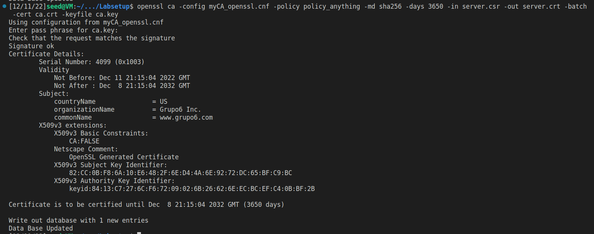
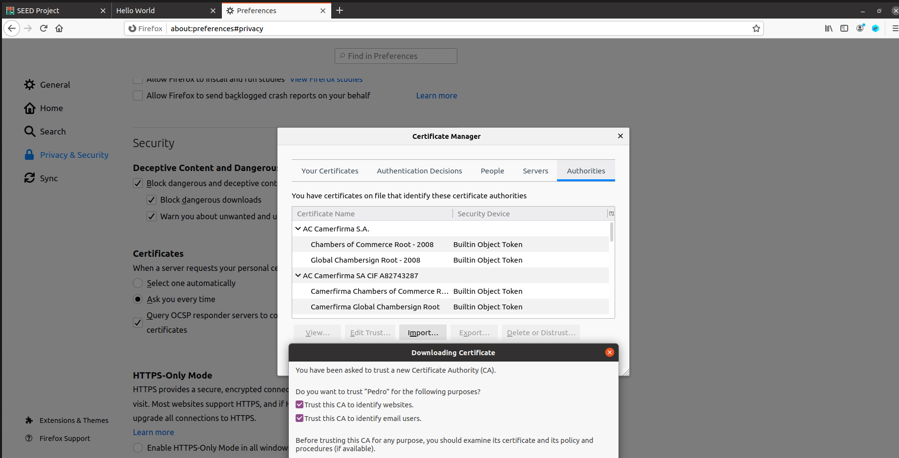
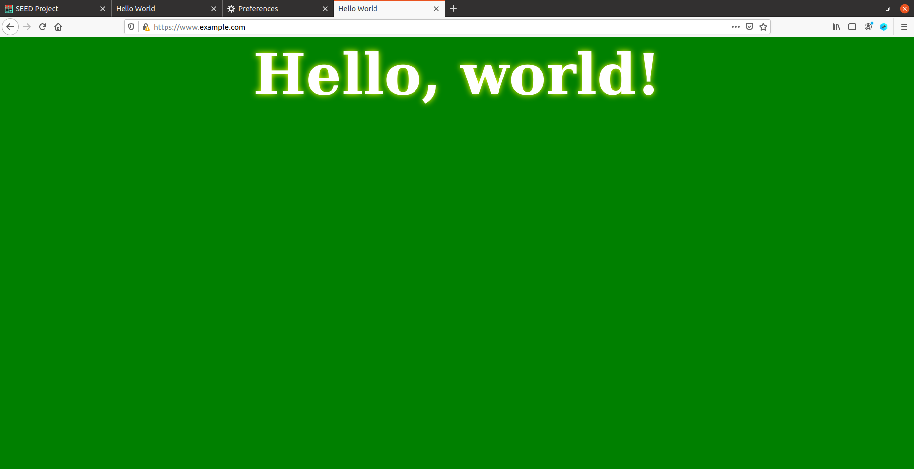

# TAREFA 1
Primeiro copiamos a configuração OPENSSL para a nossa pasta, criando o ficheiro [myCA_openssl.cnf](ficheiroslogbook11/myCA_openssl.cnf) onde está presente o seguinte conteúdo:
```
dir = ./demoCA
certs = $dir/certs
crl_dir = $dir/crl
database = $dir/index.txt
unique_subject = no
new_certs_dir = $dir/newcerts
serial = $dir/serial
```
Depois criamos a pasta `demoCA` e os ficheiros adicionais de acordo com as configurações do ficheiro a cima.
```
mkdir demoCA
cd demoCA
mkdir certs crl newcerts
touch index.txt
echo "1000" > serial
cd .. # voltar Labsestup
```
Corremos o seguinte comando para conseguir o certificado auto-assinado para a CA, gerando os ficheiros [ca.key](ficheiroslogbook11/ca.key) e [ca.crt](ficheiroslogbook11/ca.crt)
```
openssl req -x509 -newkey rsa:4096 -sha256 -days 3650 \
-keyout ca.key -out ca.crt
```
Os comandos abaixo permitem-nos olhar para o conteúdo descodificado do certificado X509 e a chave RSA como texto simples.
```
openssl x509 -in ca.crt -text -noout > task1_crt.txt
openssl rsa -in ca.key -text -noout > task1_key.txt
```
Usamos `> task1_crt.txt` e `task1_key.txt` para guardar o output destes comandos em ficheiros, [task1_crt.txt](ficheiroslogbook11/task1_crt.txt) e [task1_key.txt](ficheiroslogbook11/task1_key.txt) 

### Perguntas

**What part of the certificate indicates this is a CA’s certificate?**

No ficheiro [task1_crt.txt](ficheiroslogbook11/task1_crt.txt) na parte que diz `CA:TRUE`:


**What part of the certificate indicates this is a self-signed certificate?**

No mesmo ficheiro pudemos ver que X509v3 Subject Key Identifier = X509v3 Authority Key Identifier


**In the RSA algorithm, we have a public exponent, a private exponent `d`, a modulus `n`, and two secret numbers `p` and `q`, such that `n=pq`. Please identify the values for these elements in your certificate and key files.**

Em baixo encontram-se os valores na seguinte ordem: n (modulus), public exponent (publicExponent), d (privateExponent), p (prime1), q (prime2). Estes valores encontram-se disponíveis em [task1_key.txt](ficheiroslogbook11/task1_key.txt)

```
SA Private-Key: (4096 bit, 2 primes)
modulus:
    00:dc:08:8d:e1:ce:cb:1b:48:bb:cf:fd:c5:75:8d:
    de:5d:52:ac:9c:0b:39:0c:b4:8f:06:fc:f3:35:19:
    30:08:d6:18:d3:4e:f7:c7:3f:4b:a2:a7:7d:ab:37:
    f4:b4:ea:d8:85:eb:ef:7c:40:72:3c:c0:ef:01:35:
    6f:59:c2:d0:e4:63:81:0b:40:7b:b0:b0:f1:e1:d5:
    9d:aa:24:3b:84:69:ac:04:20:48:c0:14:15:4c:a2:
    0b:dd:3d:b2:e5:73:ce:d0:5d:b1:10:07:59:18:94:
    07:a7:e9:31:ed:02:1d:4b:de:b0:24:77:6c:3f:27:
    69:ac:cd:8c:37:a4:a2:9d:d9:c8:18:86:45:15:ec:
    68:bb:83:57:f0:ad:1d:de:9c:b9:47:36:a9:62:a0:
    a5:3f:e0:5e:c7:d1:26:4d:c8:02:38:0b:29:7f:62:
    67:95:3b:04:52:b6:27:fb:72:a4:40:d6:44:2d:18:
    e5:5c:c4:78:f3:4f:a0:31:ab:1c:b9:0a:da:2b:0e:
    63:ac:dc:8b:9c:79:55:67:8e:e5:b3:34:79:03:e6:
    20:de:cc:f2:78:77:f4:54:a0:26:d0:23:5c:b7:1c:
    da:1b:8a:a9:96:2d:20:7e:4a:dd:a2:16:f5:8d:1b:
    95:2c:d4:e1:4d:54:05:e4:9c:00:72:69:ec:5d:a1:
    92:f6:59:4f:e2:de:8e:c2:e1:42:30:5c:98:9f:93:
    59:7b:9a:0a:56:09:e4:b5:1c:ee:a7:74:50:8f:2b:
    51:a5:44:5c:9c:01:74:d1:da:ee:4d:91:58:6d:fe:
    3b:5b:3e:93:ea:43:74:20:9c:82:84:80:24:49:46:
    a2:02:d6:b2:60:d7:6d:b8:c9:9f:5b:40:f5:19:4c:
    f6:8f:e5:b5:e7:53:24:7e:fa:3c:6e:d8:9f:aa:e5:
    32:b1:e3:dc:93:81:e0:f4:01:f8:1a:74:b0:e1:7a:
    b4:8b:14:f4:70:8a:64:a4:eb:58:f6:61:a4:b5:24:
    f9:0f:a1:d5:5b:11:c8:59:41:07:e2:42:4d:93:2c:
    c7:d2:79:d1:63:bd:5c:81:a3:f0:0d:a0:12:89:b5:
    d1:97:af:ca:01:33:42:c7:ca:71:04:37:21:72:5b:
    1e:19:32:33:df:09:0e:0a:6b:78:d1:6f:77:bf:1f:
    10:18:46:56:4b:5a:74:41:78:f2:cb:39:2e:58:a2:
    c1:6c:50:65:4d:dd:49:98:12:65:e8:9a:cf:99:7c:
    05:98:2b:11:57:30:90:62:46:71:a6:a9:f2:34:f1:
    16:d4:9d:f0:54:75:70:c1:e7:84:81:35:bf:5c:1b:
    7e:c0:c6:a8:ad:d5:44:d6:43:71:0f:cf:da:95:e0:
    a7:61:1f
publicExponent: 65537 (0x10001)
privateExponent:
    00:95:46:c0:6b:47:ce:87:ae:2a:ad:0b:2f:e1:76:
    e4:3b:50:11:86:b4:1e:7a:3e:2d:22:c2:8d:85:a2:
    96:f2:07:be:43:ed:b9:30:56:02:cc:50:f1:73:2d:
    bd:38:d8:73:19:38:5d:fb:60:05:a0:ae:0b:f8:37:
    f6:59:61:50:33:02:46:d4:09:65:61:14:4a:a5:ba:
    35:02:ef:1d:e9:d1:7f:40:35:5e:e5:e1:3a:2a:09:
    6e:1f:24:f2:af:b4:87:c4:d9:2b:7d:02:5f:31:cb:
    8b:fe:20:b9:1c:60:68:db:c6:32:9e:2a:df:27:61:
    67:d2:32:89:44:5e:cf:6c:64:09:da:89:8d:69:38:
    40:3d:a6:f8:0c:72:86:67:36:d0:84:3d:d3:60:f4:
    37:e8:44:22:49:51:dd:b8:bb:4e:b6:12:ec:8e:5d:
    86:84:b9:cb:4f:0a:01:ca:17:96:d3:de:09:d6:c6:
    a3:24:f2:ae:53:f3:db:6c:96:f8:1f:99:fb:35:66:
    c7:bc:c8:cb:76:d6:e2:58:25:9c:34:9e:0e:d3:d4:
    56:cc:91:22:97:14:5a:90:e7:2e:2d:db:2f:d5:93:
    1f:6d:bb:ff:1d:c1:73:df:fa:8e:ae:9f:00:ec:40:
    a0:4e:10:06:e2:5d:74:ba:0a:14:4b:8b:0d:2e:e0:
    a5:40:75:a8:e7:de:d6:5a:22:ec:a3:ba:d9:6e:cb:
    a2:7e:70:78:b7:67:16:01:c1:58:ff:a0:60:22:9a:
    b2:9a:14:59:cc:e0:a6:58:11:05:b5:93:e2:87:09:
    f1:8c:a9:2a:18:d1:7b:56:44:80:67:c3:d3:ec:a8:
    d5:0a:e5:70:16:89:13:6c:a5:eb:cd:6a:b1:68:54:
    18:1c:1b:5c:78:0e:7c:ee:65:61:0a:4a:48:56:68:
    38:31:24:72:55:5e:ef:92:0a:6b:0c:e4:64:db:33:
    d4:10:ea:71:ef:20:bf:c5:6d:92:1f:4d:b1:ec:ae:
    12:c1:ec:f6:24:81:61:b7:62:07:ef:22:4b:a0:95:
    87:7e:81:17:4a:46:c1:f4:9d:b3:d5:89:e9:6b:41:
    29:28:a8:fd:20:4d:40:78:88:b0:87:3d:f1:bb:dd:
    c9:1a:65:b4:c9:bf:a6:a1:50:68:4e:2b:7d:18:5a:
    6c:5d:25:ae:bc:57:9c:18:90:3a:ca:cc:e6:01:33:
    10:c4:a4:20:8b:b9:0c:6e:73:98:0d:22:c7:7d:0e:
    75:c4:0e:59:90:e6:47:b6:48:82:7b:5d:97:ed:c9:
    87:f5:fa:0a:47:ce:93:47:8f:ac:ca:96:36:94:5c:
    54:66:8c:17:b1:fe:67:fc:ad:ab:c6:c9:10:13:1c:
    f6:ef:e1
prime1:
    00:ff:34:af:b4:fd:e2:af:af:3d:a6:a8:98:1c:c7:
    23:76:1c:3e:c4:3f:c9:58:04:57:70:13:67:19:c7:
    c3:1c:6a:86:23:09:eb:ad:39:ae:b6:3e:e8:fd:30:
    6c:ae:0c:49:bf:ec:66:5b:61:1e:93:25:d3:5e:e9:
    df:38:45:3b:5e:81:47:e5:4d:fb:c0:d5:b8:90:1c:
    f8:38:bc:4c:20:68:93:91:e6:6d:e9:15:8e:24:f1:
    43:3f:09:f7:d4:b1:43:5b:e0:71:2f:88:f5:17:8c:
    ec:c0:0d:3a:53:ca:fb:b7:ad:45:00:29:5e:30:c8:
    12:b5:21:1c:bc:54:71:0e:58:d8:8a:37:f6:50:dd:
    af:55:ac:e2:e6:4b:31:e0:69:35:da:13:b7:d9:75:
    0f:c2:d9:22:21:3e:8e:97:29:84:04:7e:75:7c:4d:
    31:45:79:d8:d4:f4:2f:a6:ec:ea:ce:73:cb:1e:35:
    c7:5f:a2:4c:f5:f3:cd:ff:f2:f4:ea:5c:e4:63:39:
    6f:77:ba:81:d9:bd:4d:44:18:e1:a4:1c:de:2a:1c:
    54:bb:49:a9:f2:a5:66:af:46:c2:28:89:b2:01:da:
    10:37:21:51:7e:b5:0a:a5:d9:3d:c4:04:e1:66:6e:
    4a:cd:9c:58:58:43:ce:a9:ab:cf:5d:30:fa:ce:63:
    0e:b7
prime2:
    00:dc:b7:d8:e4:eb:c8:de:15:20:62:48:5d:c0:fa:
    21:f4:60:47:62:7e:6b:83:89:a8:63:c5:bf:45:ea:
    5a:fb:70:6a:14:27:35:0a:3d:3f:76:d5:83:f7:08:
    4a:97:89:d0:a6:9a:f8:a8:56:ee:94:09:f6:31:c6:
    e1:66:f9:4a:21:7f:9f:1e:60:4d:06:df:23:89:33:
    5d:a4:0f:0a:33:9d:74:c3:17:ac:23:cb:02:69:75:
    ce:e2:e4:dc:74:83:69:cb:56:b0:72:8d:22:90:46:
    c9:59:b6:34:58:06:40:29:63:d4:d9:74:47:4d:ec:
    49:6c:63:12:fb:19:eb:bf:06:c7:6c:5d:ae:d1:05:
    41:86:ef:51:2a:76:10:59:a3:ba:5d:4a:98:a3:1d:
    a2:74:d0:1d:2e:bb:49:2a:62:1d:06:25:98:dc:87:
    c8:23:2d:28:aa:af:57:b4:55:bd:8b:03:7e:51:74:
    f2:ae:76:59:f3:2f:ec:2a:0a:a7:de:2b:5d:bd:a6:
    0b:71:5a:f0:29:c7:46:f8:98:20:74:3f:5e:f1:7c:
    d1:c7:49:bf:81:9a:2a:02:0c:b0:33:ae:d9:f5:bb:
    c9:13:ad:57:5d:fc:6e:90:c4:40:1f:3c:8d:f7:a7:
    5d:a3:4a:8d:2a:38:34:9a:e2:88:6d:18:79:ba:67:
    58:d9
```

# TAREFA 2

O seguinte comando foi usado para gerar um pedido usando a chave do nosso servidor, `www.grupo6.com`:
```
openssl req -newkey rsa:2048 -sha256 -keyout server.key -out server.csr -subj "/CN=www.grupo6.com/O=Grupo6 Inc./C=US" -addext "subjectAltName = DNS:www.grupo6.com, DNS:www.grupo66.com, DNS:www.grupo69.com" -passout pass:dees
```

A flag `-addext` utiliza a extensão Subject Alternative Name (SAN) para conectar diferentes urls, que apontam para o mesmo servidor web, ao mesmo certificado.

```
openssl req -in server.csr -text -noout
```


# TAREFA 3

Para criar um certificado, o ficheiro CSR precisa de ter a assinatura da CA, por isso vamos usar a que definimos na **Tarefa 1**.

```
openssl ca -config myCA_openssl.cnf -policy policy_anything \
-md sha256 -days 3650 \
-in server.csr -out server.crt -batch \
-cert ca.crt -keyfile ca.key
```



Como é possível observar na imagem de cima, os nomes alternativos que definidos não aparecem. Isto porque, por razões de segurança, a configuração default do `openssl.cnf` não permite o comando `openssl ca` copiar o campo de extensão do pedido para o certificado final.

Para ativar esse comando basta descomentar a seguinte linha na nossa cópia do ficheio openssl.cnf
```
# Extension copying option: use with caution.
copy_extensions = copy
``` 

Voltando a criar um certificado podemos ver que os nomes alternativos já aparecem


Ao correr o comando abaixo podemos ver os nomes alternativos no certificado descodificado, tendo guardado o output no ficheiro [task3_crt.txt](ficheiroslogbook11/task3_crt.txt):

```
openssl x509 -in server.crt -text -noout
```


# TAREFA 4

Primeiro começamos por alterar o Dockerfile para o que está em baixo:

```dockerfile

FROM handsonsecurity/seed-server:apache-php

ARG WWWDIR=/var/www/grupo6

COPY ./index.html ./index_red.html $WWWDIR/
COPY ./grupo6_apache_ssl.conf /etc/apache2/sites-available
COPY ./certs/server.crt ./certs/server.key  /certs/

RUN  chmod 400 /certs/server.key \
     && chmod 644 $WWWDIR/index.html \
     && chmod 644 $WWWDIR/index_red.html \
     && a2ensite grupo6_apache_ssl   

CMD  tail -f /dev/null

```

Depois criamos o ficheiro `rupo6_apache_ssl.conf` que contém:

```xml
<VirtualHost *:443> 
    DocumentRoot /var/www/grupo6
    ServerName www.grupo6.com
    ServerAlias www.grupo66.com
    ServerAlias www.grupo69.com
    DirectoryIndex index.html
    SSLEngine On 
    SSLCertificateFile /certs/server.crt
    SSLCertificateKeyFile /certs/server.key
</VirtualHost>

<VirtualHost *:80> 
    DocumentRoot /var/www/grupo6
    ServerName www.grupo6.com
    DirectoryIndex index_red.html
</VirtualHost>

# Set the following gloal entry to suppress an annoying warning message
ServerName localhost
```

De seguida contruímos  o container e entramos nele usando `dockps` seguido de `docksh <id>`. Dentro dele corremos `service apache2 start` e inserimos a password (`dees`) para iniciarmos o servidor.


Ao entrarmos em https://www.grupo6.com no firefox pela primeira vez é nos mostrado um aviso de segurança:


Isto acontece porque o Firefox só tem certificados altamente seguros no seu banco de certificados, o que significa que um certificado auto-assinado é um motivo para lançar um aviso num navegador moderno.

Para evitar isto podemos:
- Criar uma exceção  no browser e permitir que o domínio seja acedido
- Arranjar uma forma de dizer ao navegador para confiar na nossa CA

Na imagem em baixo nós dizemos ao browser para criar uma exceção:


Para fazer com que o Firefox confie no nosso certificado basta ir para `about:preferences#privacy` e procurar pela secção dos certificados e submeter o nosso certificado, `ca.crt`:




 


# TAREFA 5

Primeiro decidimos repetir o que foi feito nas tarefas anteriores e gerar uma nova configuração apache no Docker com o nome do servidor `www.example.com`

De seguida inserimos no `/etc/hosts`: **10.9.0.80 www.example.com**.

Mesmo depois de darmos exploit à rota da DNS, continua-nos a aparecer um aviso de segurança:


Isto acontece porque o certificado que usamos para assinar `www.example.com` foi emitido por `www.grupo6.com`.  Websites modernos conseguem detetar este tipo de inconsistências nos certificados  e avisar os utilizadores.

Se aceitarmos o risco conseguimos aceder ao nosso clone malicioso
 
 

 # TAREFA 6
 
Quando um CA é comprometido, um atacante pode assinar os seus próprios certificados e fazer-se passar por outros websites.

Assim, geramos o certificado para o site `www.example.com` correndo o comando da 2º Tarefa, mas desta vez, especificando `example.com` como a entidade que requer a identificação.


Depois disto é necessário assinar o nosso certificado com a CA. Mais uma vez, só tivemos que executar os passos realizados anteriormente:


Finalmente, ao acedermos ao site vemos que temos uma ligação segura.

