## Tarefa 1
- Variáveis de ambiente:
    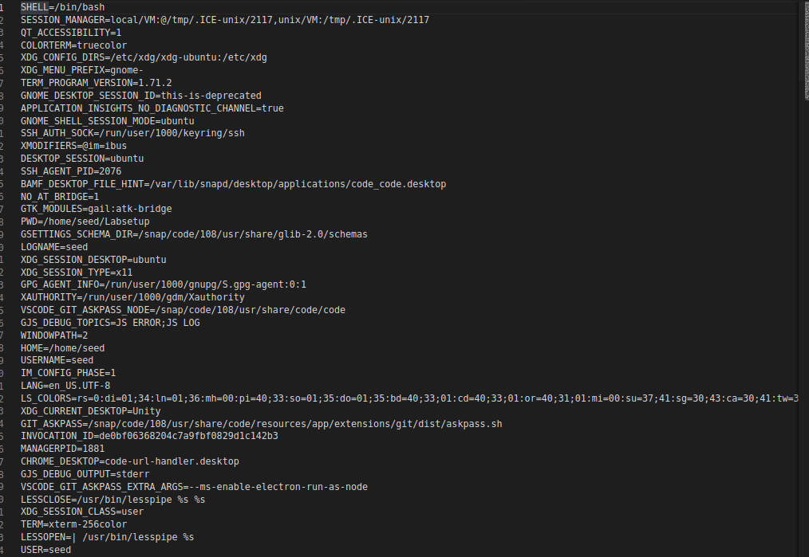
    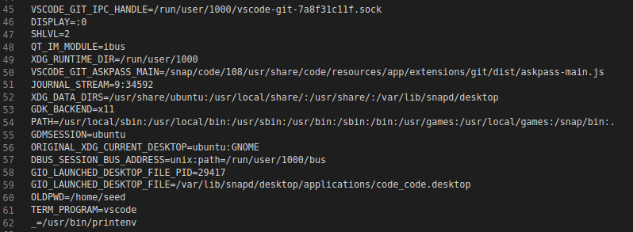
## TAREFA 2
- Coloca-mos as variáveis de ambiente do filho no file1:

    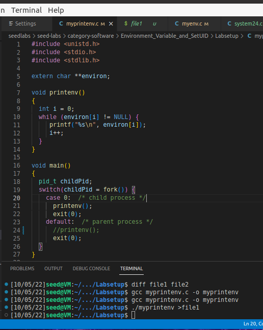
- Coloca-mos as variáveis de ambiente do pai no file2:

    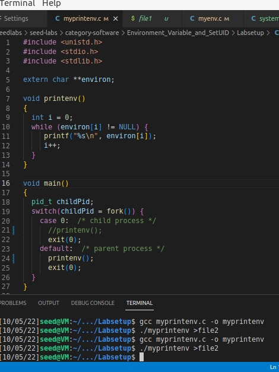
-  Ao comparar os ficheiros, conseguimos observar que o filho tem as mesmas variáveis de ambiente que o pai :
    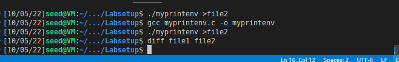

## TAREFA 3
- Usando NULL conseguimos observar que não temos variáveis de ambiente:

    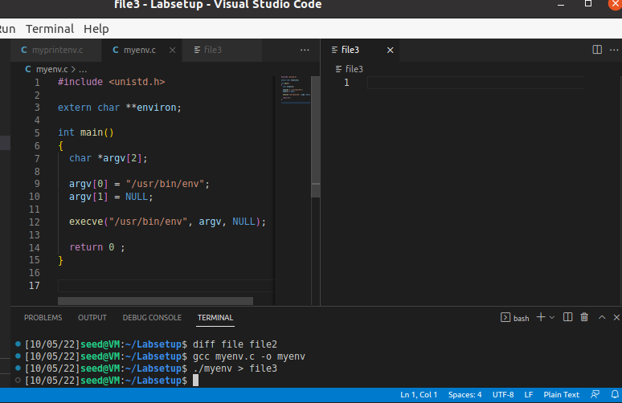
- Usando environ, guardando no file4, temos as variaveis de ambiente expectáveis:
    
    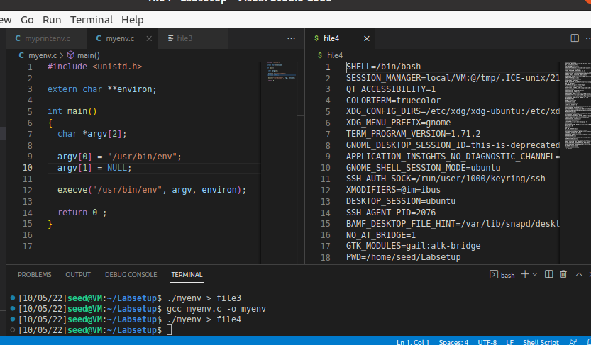
- Isto acontece uma vez que a função execve() vai buscar as variáveis de ambiente ao seu parâmetro ENVP,logo quando este é NULL não vamos conseguir nenhuma variável.

## TAREFA 4

- Ao correr o programa e guardá-lo no file5 e compará-lo com o file4, da tarefa 3, conseguimos observar que a única diferença é o OLDPWD

    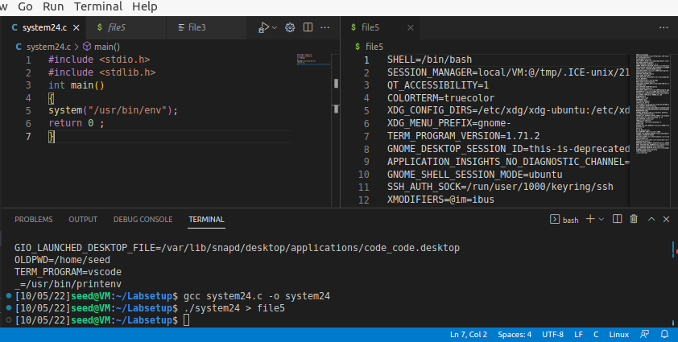

    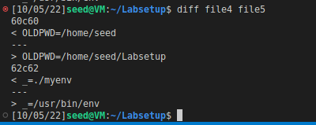

## TAREFA 5
- Depois de compilar o programa e fazer as alterações pedidas guardamos o output no file6 onde conseguimos ver lá a variável de ambiente que nós criamos: 

    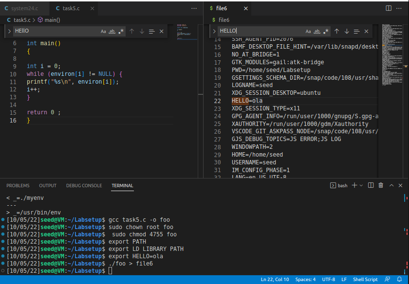

- A seguir guardamos as variáveis de ambiente no file7 e comparamos os dois ficheiros. Ao compararmos os dois ficheiros concluimos que o processo corrido na shell herdou todas as variáveis de ambiente:

    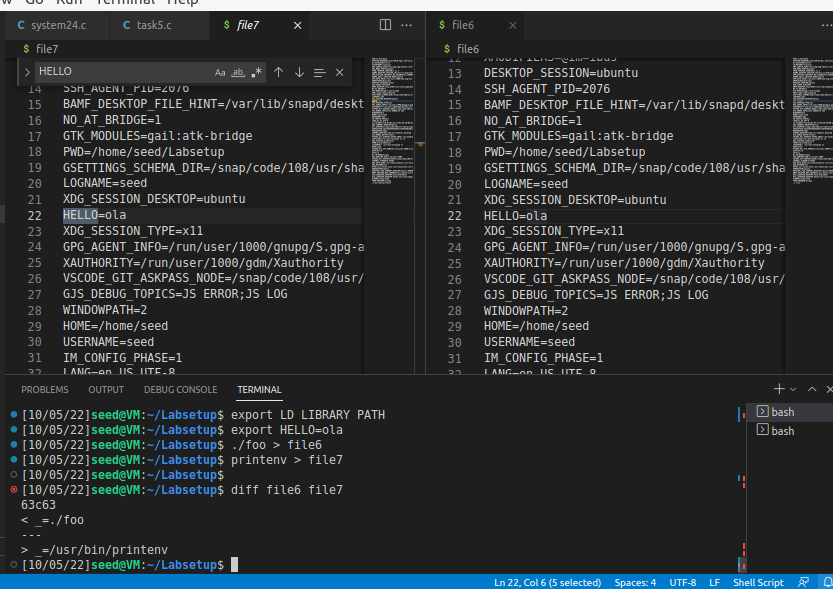

## TAREFA 6

- No início, depois de mudarmos o dono para root e torná-lo num programa Set-UID, o programa continua a chamar o ls esperado:

     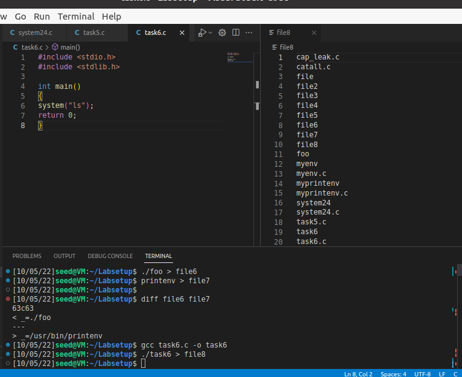

- Decidimos então mudar o PATH para um em que tinhamos um ficheiro chamado ls com código escrito por nós. Ao correr outra vez o programa, conseguimos fazer com que o comando system("ls") corresse a nossa versão.  Esta versão tinha também o privilégio root. 

     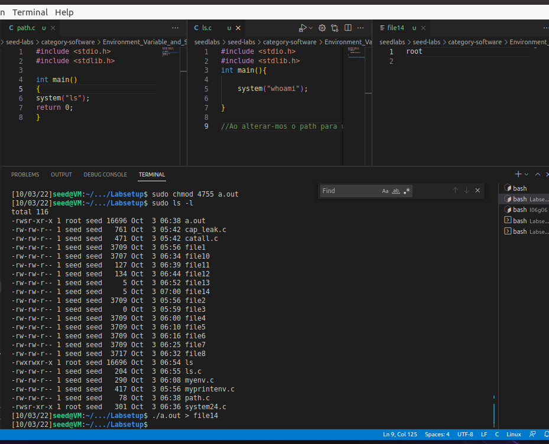

Nota*: Nesta print o a.out é o task6 da anterior 

### CTF #1:
O primeiro passo foi usar as dicas fornecidas no Moodle e procurar as versões das ferramentas usadas no site. Esta informação estava presente na secção "Additional Information" do pacote WordPress Hosting anunciado na loja:

> Wordpress: 5.8.1
> WooCommerce plugin: 5.7.1
> Booster for WooCommerce plugin: 5.4.3

Recorrendo ao site exploit-db.com, verificou-se que o Booster tinha uma vulnerabilidade do tipo "Authentication Bypass" (https://www.exploit-db.com/exploits/50299), pelo que foi essa a vulnerabilidade selecionada (resolvendo assim o 1º desafio).

De seguida, executámos o [exploit](CTF/Semana4/exploit.py) disponível nessa página e obtivemos o seguinte output:

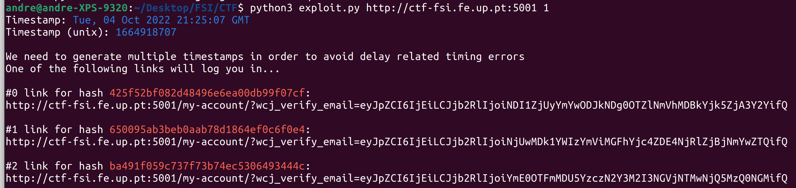

Usando o primeiro link, conseguimos aceder à conta do administrador:

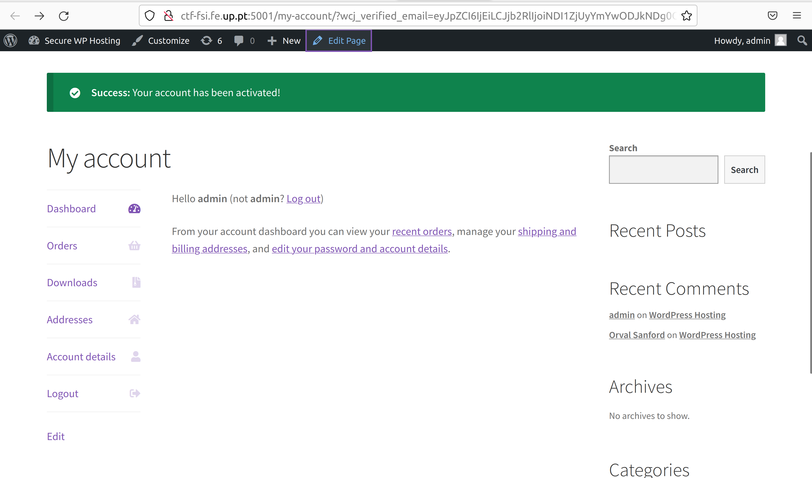

Por fim, acedemos ao link fornecido no Moodle (http://ctf-fsi.fe.up.pt:5001/wp-admin/edit.php) e tivemos acesso à segunda flag, resolvendo assim o 2º desafio.

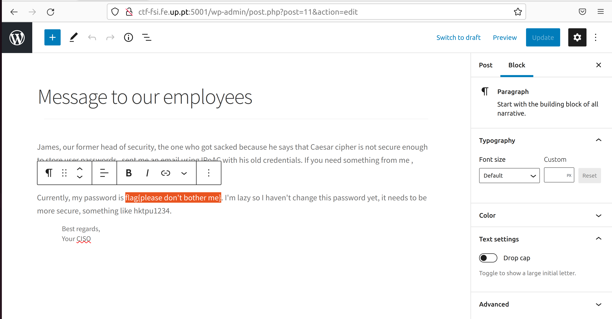

