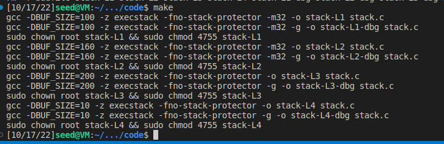

## TAREFA 1 
 - Como é possível observar, conseguimos obter duas shells ambas com o mesmo utilizador

 

## TAREFA 2

## TAREFA 3 
- Como indicado descobrimos a localização do ebp e do buffer

    

- De seguida alteramos o ficheiro [exploit.py](ficheiroslogbook5/exploit.py) de acordo com a informação obtida.
    - Como estão alocados 517 bytes para o buffer, decidimos colocar o final shellcode no final do buffer, para maximizar a oportunidade de calharmos numa zona com NOP's;
    - Necessitamos que o endereço de retorno aponte para uma zona da stack de modo ao nosso shellcode ser executado. Deste modo usamos o valor 256 bytes de forma a que o endereço de retorno aponte para uma zona contendo NOP's, uma zona de 490 bytes. Não é obrigatório que seja este valor, basta qualquer offset que calhe na zona dos NOP's dado que as instruções NOP fazem com que a instrução passe para o byte de memória seguinte.
    - Por fim, é necessário calcular o offset onde deverá ser colocado o endereço de retorno previamente calculado. Para isso fazemos ebp-buffer+4 : 
        - O ebp-buffer indica-nos a "distância" entre o início do buffer e do frame pointer,
        - O +4 serve para colocar o endereço do return address, que se encontra 4 bytes acima do endereço do frame pointer.

- Resultado:

    

## CTF #1

No primeiro desafio, descobrimos que havia uma vulnerabilidade no programa que usa o script fornecido no ficheiro [main.c](CTF/Semana5-Desafio1/main.c): na linha 11, a função scanf lê 28 bytes do stdin e armazena-os no buffer. No entanto, o buffer só pode armazenar 20 bytes, logo, os restantes 8 bytes vão ser escritos no valor da variável "meme_file". Esta vulerabilidade permite que o atacante, recorrendo à técnica *buffer overflow*, altere o comportamento do programa. Neste caso, o objetivo era alterar de forma a ler o ficheiro "flag.txt". Para tal, bastou fazer com que o ficheiro de exploit enviasse 20 bytes para preencher o buffer (neste caso, enviámos 20 "a") e, de seguida, enviar a string "flag.txt", obtendo o seguinte resultado:

O código usado para fazer exploit encontra-se [aqui](CTF/Semana5-Desafio1/exploit.py).

## CTF #2

O segundo desafio é muito semelhante ao primeiro: a única diferença é que entre o buffer para onde é lido o stdin e o buffer onde está guardado o nome do ficheiro a ler pelo programa, existe uma variável que funciona como um canário: tem um valor já atribuído de início, pelo que o programa só executa se esse valor não for alterado. No entanto, como temos acesso ao código fonte, é simples determinar qual é o valor que é preciso  manter inalterado, pelo que simplesmente adaptámos o exploit do desafio anterior para enviar na mesma 20 bytes, depois enviar o valor do canário e, por fim, enviar a string "flag.txt". Quando executámos o exploit, obtivemos o seguinte resultado:

O código usado para fazer exploit encontra-se [aqui](CTF/Semana5-Desafio2/exploit.py).
