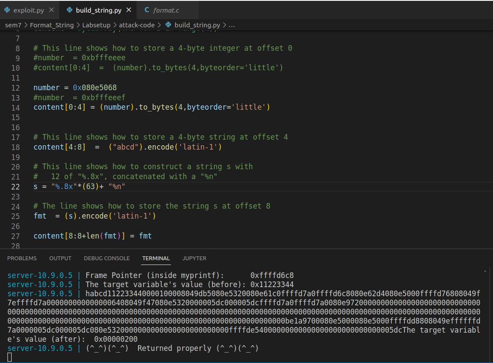

# Tarefa 1

 -  Nesta tarefa temos como objetivo crashar o programa. A forma de o fazer é ao abusar o "%n".
 - O "%n"  em vez de dar print a alguma coisa faz com que o printf coloque na variável apontada no respetivo argumento o número de caracteres que foram impressos pelo printf antes da ocorrência de %n.
- Desta forma, nós conseguimos dar overwrite ao endereço de retorno, crashando assim o programa.
 

# Tarefa 2

 - A) O objetivo da tarefa 2.a é ler os primeiros 4 bytes da string que mandamos para o servidor. 
    - Para isso temos d mudar a string de forma a que tenha os 4 bytes que nós queremos no início, nós escolhemos 0xbfffeeef. Depois, nós escrevemos "%.8x" o número necessário de vezes até chegarmos ao início da nossa string. 
    - No nosso caso o número necessário de vezes foi 64, sendo este número conseguido depois de várias tentativas.
  

  -B) Na tarefa 2.b precisamos de ler a mensagem secreta.
  - É possível observar que o servidor já nos dá o endereço que contém a mensagem secreta.
  - Logo decidimos substituir o valor inicial da nossa string do 2.a pelo valor do endereço pretendido, 0x080b4008.
  - De seguida, vimos que, da forma como estava, o programa não nos dava o conteúdo do endereço, apenas o endereço em si. Então em vez de usarmos "%.8x" 64 vezes usamos "%.8x" 63 vezes e um "%s" na 64º vez, uma vez que o "%s" interpreta o número como um endereço e lê o que está nele.
   

- Como é possível observar em cima, a mensagem secreta é "A secret message"
# Tarefa 3

- A) O objetivo desta tarefa é alterar o valor da variável do alvo para outra coisa qualquer.
    - Como foi feito na tarefa 2.b, podemos aceder ao endereço colocando-o no início da nossa string, sendo desta vez 0x080e5068.
    - Sabemos que conseguimos acedê-lo usando 64 "%.8x". Para alterar o valor de 0x11223344 para outro qualquer bastou usar "%.8x"*63+"%n". Desta forma vamos conseguir meter no endereço o número de caracteres que foram escritos, que neste caso foram 512.
     
    
 - B) O objetivo desta tarefa é o mesmo que o 3.a só que desta vez tem de ser para o valor 0x00005000.
    - Sabemos que o "%n" vai escrever o número de caracteres quem aparecem antes dele, logo temos de fazer com que apareçam 20480 caracteres antes do "%n".

# CTF 1
Neste desafio, dado que os endereços de memória são estáticos e a flag foi carregada para um buffer que é uma variável global, construimos um [exploit](CTF/Semana7-Desafio1/exploit_example.py) simples que lê a flag que já sabemos que está presente no endereço 0x804c060. Este valor foi obtido utilizando o gdb:

Bastou correr o exploit e obtivemos a flag:

# CTF 2
Neste caso, o objetivo era alterar o valor da variável global key para 0xbeef de forma a conseguirmos obter uma shell. 
- Em primeiro lugar, conseguimos obter o nosso input utilizando apenas um "%x", descobrindo assim a posição do nosso input na stack. 
- De seguida, como queremos escrever um valor num endereço usando o printf, recorremos ao "%n": como este operador escreve no endereço de memória dado o número de bytes impressos até esse ponto, criamos a seguinte payload: `(0xffffffff).to_bytes(4,byteorder='little') + (0x804c034).to_bytes(4,byteorder='little') + ("%.48871x%n").encode('latin-1')`.
- No início da payload encontra-se um valor sem significado (escolhido por nós) que apenas serve para ser consumido pelo "%x". Depois desse valor, colocamos o endereço da variável global key (este endereço vai ser usado pelo %n) e, por fim, usámos o operador "%.48871x" para imprimir os 4 bytes iniciais da payload, com um padding de 48871 bytes, de tal modo que o número total de bytes impressos é 4 (bytes iniciais escolhidos por nós) + 4 (endereço para onde queremos escrever) + 48871 (padding) = 48879 = 0xbeef.
- Deste modo, conseguimos alterar o valor da variável key para o valor pretendido, obtendo assim a shell:

PS: o endereço da variável key foi descoberto com o gdb:
