# Tarefa 1
- Depois de termos conseguido acesso à base de dados, usamos a seguinte query para conseguir as informações da Alice:
```sql
 select * FROM credential WHERE name='Alice';
 ```

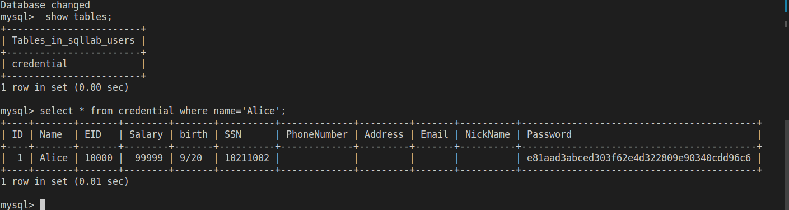


# Tarefa 2
## Tarefa 2.1
- Depois de observar-mos o código, decidimos que se queríamos aceder ao admin usando SQL Injection tinhamos de tirar proveito do 'username' deste extrato de código:
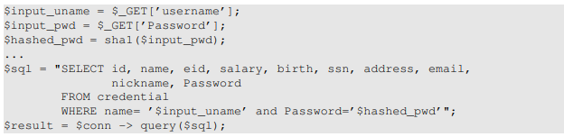

- Se no username se inserir uma string com o formato `username' OR '1=1 ` conseguimos fazer com que o SQL procure por uma linha que tenha o username que colocamos ou então vai ver se existe uma linha com 1=1 e com a password dada. Assim basta colocar um username que exista na base de dados para conseguir entrar na conta dele.
<br> Em baixo encontra-se parte do código que vai ser compilado após o input quando entrar no admin
```sql
WHERE name= 'admin' OR 1=1 and Password='$hashed_pwd'";
```

- Como resultado desse input, obtemos a página abaixo.

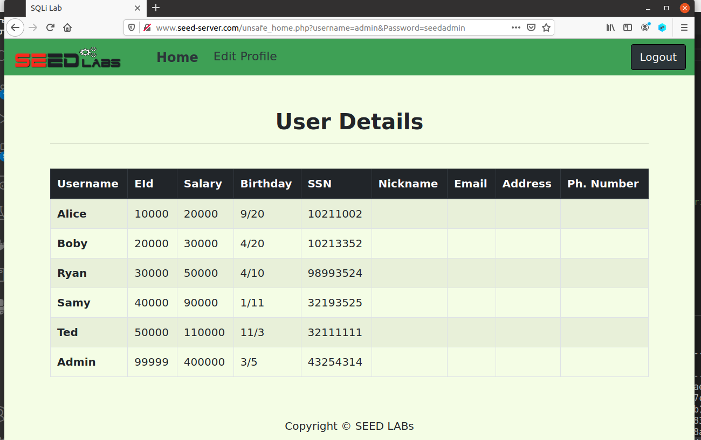

## Tarefa 2.2

- Em baixo está representado o comando curl usado para conseguir a página HTML do admin. Notar que o `%27` representa `'` e o `%3D` representa o `=`.

```bash
curl 'www.seed-server.com/unsafe_home.php?username=admin%27OR%271%3D1&Password='; 
```
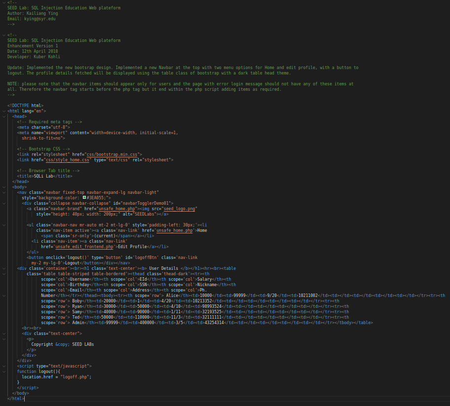

## Tarefa 2.3

- Depois de tentarmos vários comandos SQL deparávamo-nos sempre com este erro:

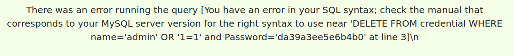

- Descobrimos que este erro é gerado por uma contra-medida implementada em `unsafe_home.php`
no qual é usado `mysqli::query()`.
Isto significa que não vamos conseguir usar um SQL Injection deste tipo uma vez que a a APi da `mysqli::query()` não permite que várias queries serem corridas na base de dados do servidor, devido às possíveis SQL Injections.

```php
$conn = new mysqli($dbhost, $dbuser, $dbpass, $dbname);
$result = $conn->query($sql)
```

# Tarefa 3
## Tarefa 3.1
- Para alterar o salário da Alice basta colocar no nickname uma string do género `',salary='99999`, sendo que neste caso iria alterar o salário dela para 99999.

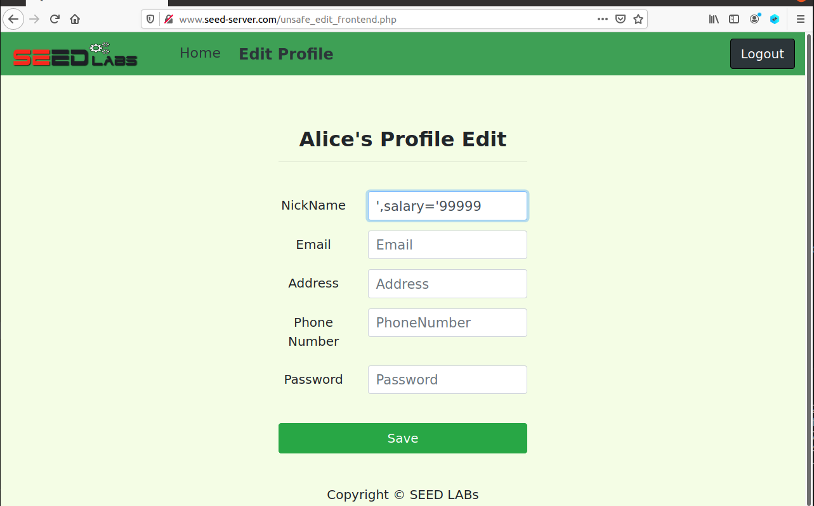
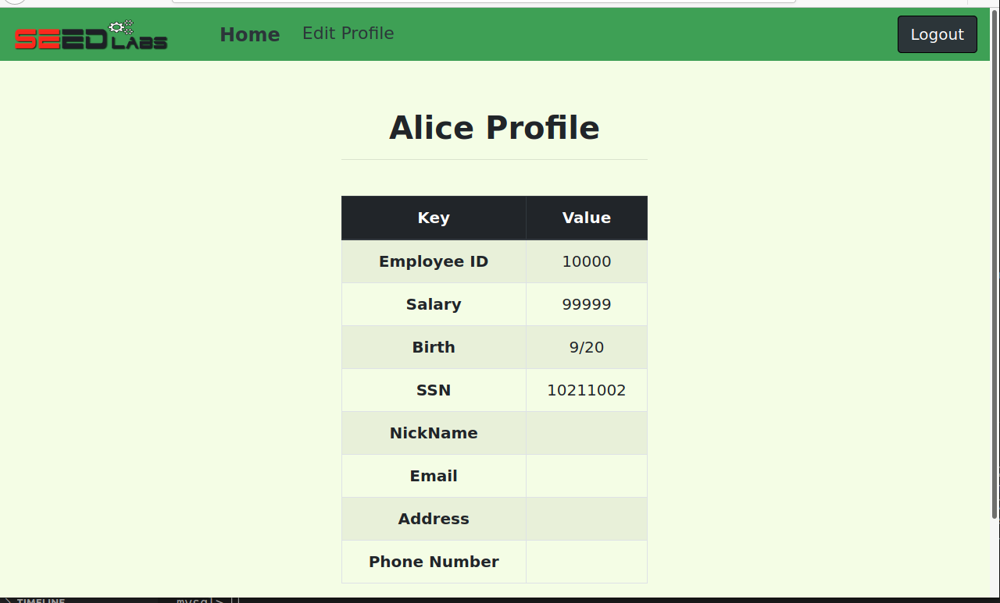

## Tarefa 3.2
- Para conseguir alterar o salário do Boby para 1 usou-se esta string no nickname: `',salary=1 WHERE name='Boby';#`. Isto deve-se ao facto de o símbolo `#` fazer com que o resto do código seja comentado até à aspa final da string da query.
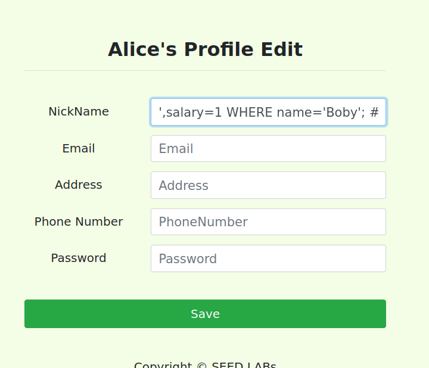
- Entrando no perfil do Boby conseguimos ver que o seu salário foi alterado.
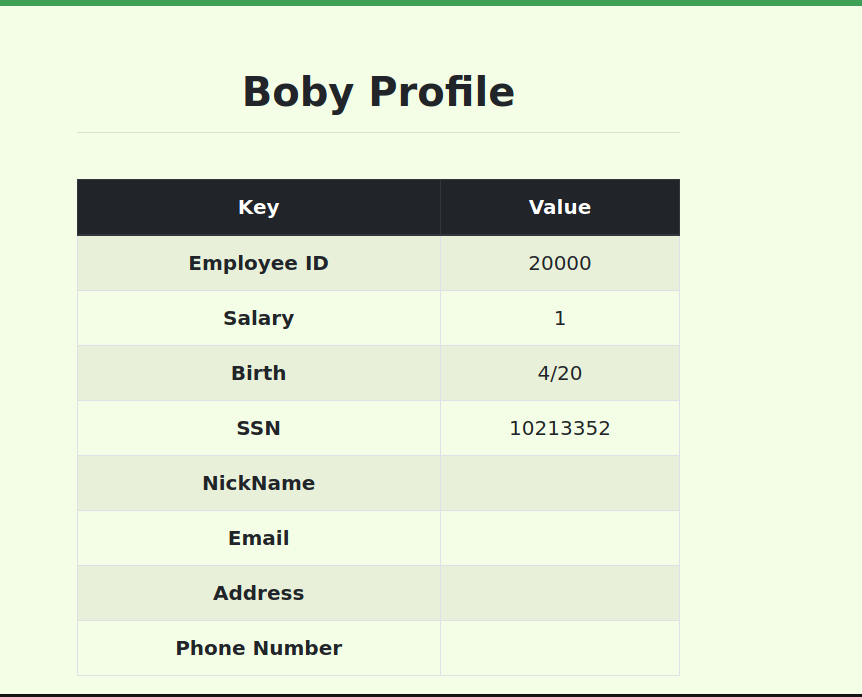

## Tarefa 3.3
- Nesta tarefa usou-se a mesma técnica que na anterior só que em vez de se fazer `salary=1` usou-se `Password=my_password`. No nosso caso decidimos usar `olaboby` como `my_password`.<br>
Como as passwords na base de dados são guardadas após ser aplicada a função de hashing com SHA1 vimos primeiro como era `olaboby` em SHA1:

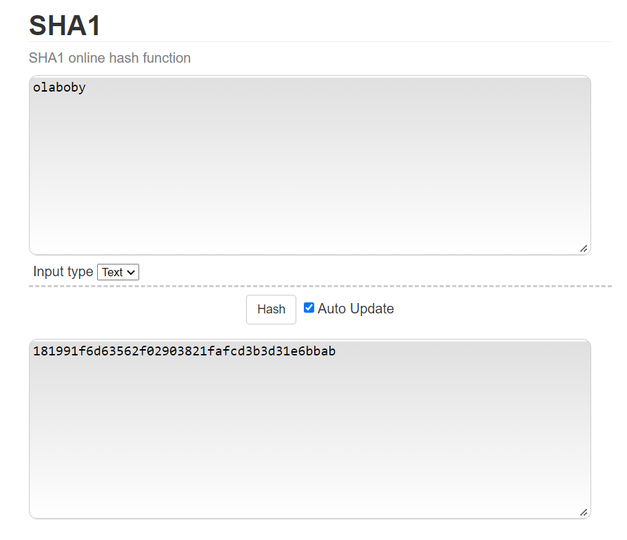

- Após isso foi só inserir a string `',Password='181991f6d63562f02903821fafcd3b3d31e6bbab' WHERE name='Boby';#` no nickname:
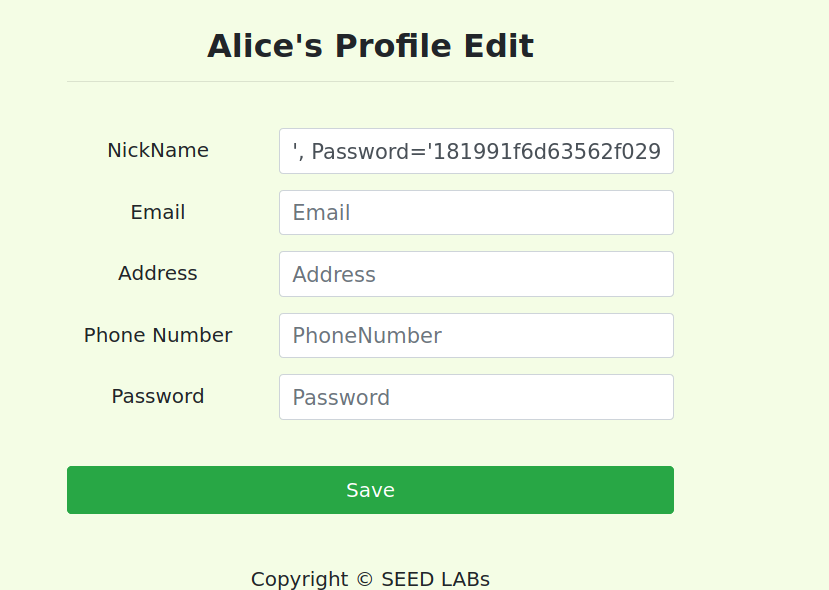
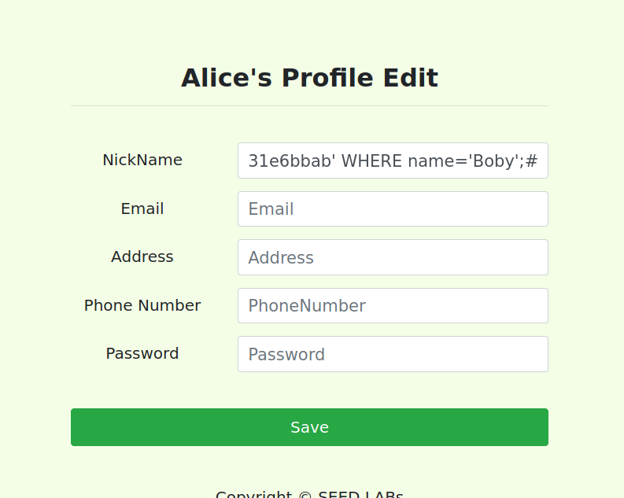

- Na base de dados é possível ver que a password de Boby tem o valor que lhe demos:
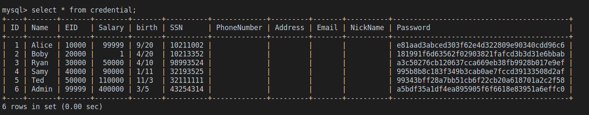


# CTF 1
A primeira coisa que decidimos fazer foi ver como era chamada a query no código disponível, que neste caso é assim:
```php

    $username = $_POST['username'];
    $password = $_POST['password'];
               
    $query = "SELECT username FROM user WHERE username = '".$username."' AND password = '".$password."'";
     
```
Reparamos imediatamente que conseguiamos fazer uma SQL Injection tirando proveito do `$username`.<br>
Se no username inserirmos `admin';#` facilmente conseguimos entrar na conta do utilizador.
Isto deve-se ao facto de que `#` comenta o código todo que vem à frente, fazendo com que a query não veja se a `password` que foi inserida existe ou não na base de dados.
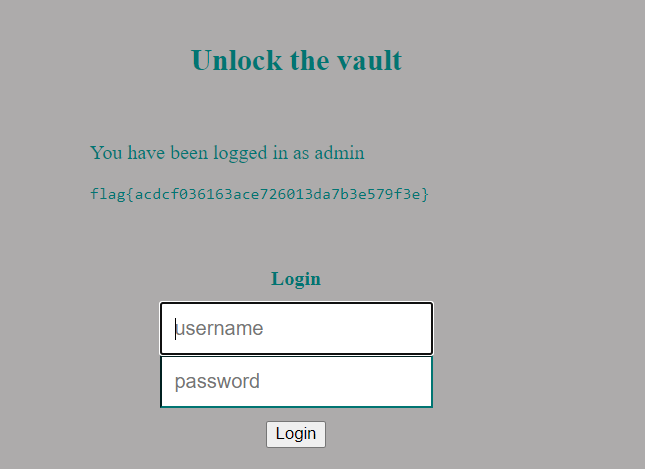
# CTF 2
Após analisarmos o código fonte disponibilizado, rapidamente descobrimos que a função "gets" introduz uma vulnerabilidade de buffer overflow no programa. Para além disso, a informação fornecida pelo checksec mostrou que basta um simples buffer overflow com alteração do endereço de retorno da função tal que ao retornar, o programa execute o nosso shellcode. Esta tarefa foi facilitada por não existir canário e a stack ser executável:
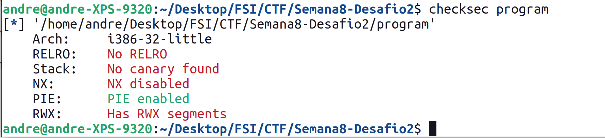

De seguida, utilizamos o gdb para calcular a "distância" (em bytes), desde o início do buffer de input (cujo endereço é fornecido pelo próprio programa) e o endereço de retorno da função:
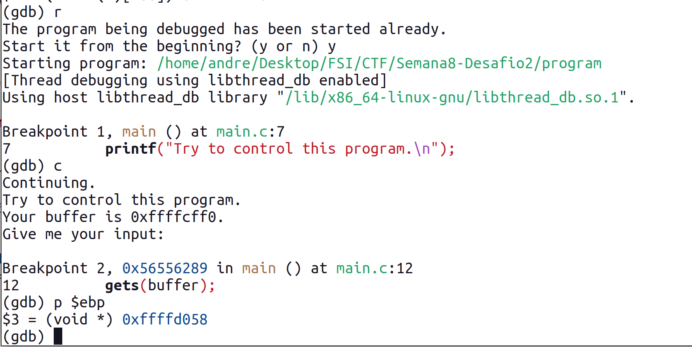

Obtendo assim o valor 108 = ffffd058 (endereço do base pointer) - ffffcff0 (endereço do buffer) + 4 (offset entre o base pointer e o endereço de retorno da função)
Também é importante referir que podemos usar o valor hard-coded do endereço base do buffer porque o offset entre o início buffer e o base pointer é constante entre execuções.

Concluindo, fizemos ligeiras alterações ao exploit usado no primeiro lab de buffer overflow.
Por fim, executámos o nosso [exploit](CTF/Semana8-Desafio2/exploit.py) e obtivemos a flag:
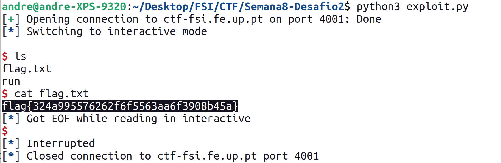