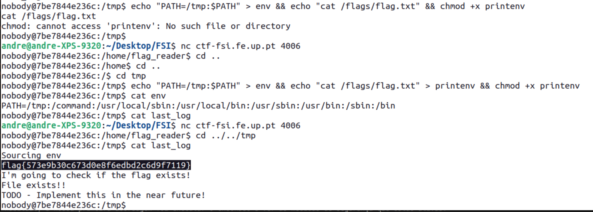

# British Punctuality
Inicialmente, executamos o executável "reader" que nos informou que o ficheiro da flag não existia. Assim sendo, analisando o source code, na realidade o ficheiro existe mas o utilizador não tem permissões para aceder a ele.
Assim, como o título e descrição do CTF referem muito a passagem do tempo, fomos remetidos para pensar em possíveis vulnerabilidades de escalamento de privilégios que surgiram por causa do uso do cron.
Seguindo esta teoria, começamos a explorar as pastas associadas ao cron (dentro da pasta "etc") e descobrimos o script "my_cron_script", que a cada minuto executa o shell script my_script.sh presente na pasta "flag_reader" e guarda os resultados no ficheiro last_log da pasta "tmp". O my_script.sh simplesmente envia o conteúdo do ficheiro env da pasta tmp para o ficheiro /usr/bin/xargs, chama a função "printenv" e executa o executável "reader" referido anteriormente.

Assim sendo, a vulnerabilidade encontra-se no facto de, se se alterar o PATH, poder-se chamar uma função printenv (chamada no my_script.sh) maliciosa que vai correr com os privilégios do utilizador do cron.

Como a pasta tmp é a única pasta onde conseguimos escrever, criamos um ficheiro "env", que vai alterar o PATH usado pelo cron, usando `echo "PATH=/tmp:$PATH" > env` e um ficheiro "printenv" com `echo "cat /flags/flag.txt" > printenv` e fizemos com que o ficheiro fosse executável com `chmod +x printenv`.

Deste modo, obtivemos a flag:


# Final Format
Numa primeira fase, sentimos necessidade de ler a dica disponibilizada no próprio servidor e que nos apontou na direção da tabela GOT. 
Após lermos e estudarmos o que é a tabela GOT e a tabela PLT, percebemos que é possível alterar o fluxo do programa se alterarmos o endereço (na própria tabela GOT) de uma função que seja usada no programa para uma outra função à nossa escolha. Assim sendo, efetuamos os seguintes passos:
- Como a vulnerabilidade é a ausência de format string na função printf, temos de aplicar o exploit a uma função que esteja presente na GOT e que se encontre depois da chamada ao printf. Analisando o assembler dump da função main, concluímos que a função fflush cumpre os requisitos que enunciamos, pelo que é um bom candidato:

Concluímos que o endereço da função fflush na tabela GOT é 0x804c010, pelo que já sabemos qual é o endereço de memória cujo valor queremos alterar. 
- Agora que obtivemos o endereço de memória, temos de decidir qual a função que queremos que seja executada em vez do fflush: numa primeira fase, pensamos em usar a função system("/bin/sh"), no entanto não sabíamos como lidar com o argumento da função, pelo que decidimos simplificar e ver se já havia alguma função no binário para isso. Tendo esta abordagem em conta, no gdb, verificámos que existe uma função old_backdoor que chama a função system, pelo que é a nossa função objetivo:

Concluímos também que o endereço da função é 0x08049236.

Por fim, criamos o exploit com a seguinte payload:
`(0x0804c010).to_bytes(4,byteorder='little') + (0x0804c010+2).to_bytes(4,byteorder='little') + ("%1$37422x%1$n").encode('latin-1') + ("%30158x%2$n").encode('latin-1')`
Ou seja, usamos o %n para aceder ao endereço 0x0804c010 e escrever o valor 0x08049236 (134517302 em decimal) para alterar o fluxo do programa para a old_backdoor. No entanto, como 0x08049236 é um valor mesmo muito grande, não se pode simplesmente imprimir esse número de bytes (como nos outros exercícios) porque ia demorar horas a fazê-lo, pelo que optamos por dividir o número em 2 componentes: 0x0804 (2052 em decimal) e 0x9236 (37430 em decimal) e escrevemos a 2ª componente (0x9236) no endereço 0x0804c010 e a 1ª componente (0x0804) no endereço 0x0804c010 + 2. Com este método, imprimimos apenas 2052 + 37430 = 39 482 bytes que é muito menor que 134517302, sendo por isso muito mais rápido.

Executando o [exploit](CTF/Semana7-Opcional/exploit.py), tivemos acesso à shell:


# Echo
Como habitual, a nossa primeira abordagem foi executar o checksec e ver as medidas de segurança que estão ativas:


Concluimos que todas as medidas de segurança estavam ativas, pelo que corremos o programa e procuramos vulnerabilidades, fornecendo diversos input e concluímos que:

> Existe uma vulnerabilidade de format string quando o nome é impresso:
> 

> Existe uma vulnerabilidade de buffer overflow no campo do nome (introduzimos um input de 200 'a' e o programa retornou 99 'a', sendo que a mensagem diz que o máximo são 20 characters):
> 
> Convém referir que, devido ao overflow, o programa entrou num estado de erro (comprovado pelo facto de ao enviar um 'q' o programa não terminar).

Tendo estas vulnerabilidades em mente e tendo em conta que nos foi fornecida uma libc, percebemos que não podíamos fazer um simples buffer overflow com shellcode visto que a stack não é executável.
Assim sendo, decidimos que devíamos usar o buffer overflow para alterar o endereço de retorno da função (pareceu-nos ser a única hipótese para alterar o fluxo do programa), no entanto, o facto de existir um canário dificulta a tarefa, mas, como o programa também é vulnerável a format string pensamos na hipótese de fazer leak do canário com a format string e, no overflow, posicionar a payload de forma a manter o canário inalterado.

Agora, a questão é: que valor colocar no endereço de retorno? Decidimos que uma opção era colocar o endereço de retorno da função system e passar à função a string "/bin/sh", visto que nos desafios anteriores o objetivo era sempre ter acesso a uma shell.

Assim sendo, precisamos de concluir as seguintes tarefas:
- Identificar a posição do canário na stack e fazer leak do mesmo com format string:
  - O canário, quando está presente, termina sempre com NULL e está presente entre o buffer e o resto das variáveis da função. Recorrendo ao gdb, descobrimos onde é que ele estava:
    - 
  - Para obter o canário com format string, usamos a string "%8$p" que imprime o 4 bytes do nono elemento da stack.
    - 
- Identificar a distância entre o início do buffer de input (do name) e o endereço de retorno da função
  - Para obter esta informação recorremos ao gdb:
  - 
  - Concluimos: o endereço de retorno corresponde ao endereço assinalado, que se encontra na 2ª posição de memória depois do canário (que por sua vez está na 2ª posição de memória relativamente ao final do buffer de input).
- Identificar o endereço da função system, na libc
  - Devido às medidas de segurança implementadas, não podemos simplesmente usar um valor hard coded, pois o endereço da função system muda entre execuções. No entanto, apesar de a posição em memória da libc ser variável, os offsets entre as diferentes funções da libc são constantes, pelo que se se obtiver o endereço de qualquer função da libc, sabe-se o endereço de todas as outras, nomeadamente da função system. Assim sendo, a função main retorna para uma função da libc para terminar o programa, pelo que o próprio endereço de retorno na função main é o endereço de uma função da libc! Deste modo, usamos o gdb para saber o endereço da função system e o endereço de retorno e calculamos o offset: 0xf7dc2cb0 (system) - 0xf7d9c519 (endereço de retorno) = 0x26797. No entanto, como o valor da função do endereço de retorno é variável, precisamos de usar a vulnerabilidade de format string para obter o valor do endereço de retorno (tal como foi feito no caso do canário). Tal valor pode ser obtido com "%11$p", visto que se encontra na 12ª posição da stack (a partir do esp).
  - 
- Encontrar uma maneira de chamar o system com a string /bin/sh:
  - Visto que esta string é muito usada pelas funções da libc, decidimos tentar encontrar um endereço dela na mesma, recorrendo ao gdb:
    - 
  - Como a string está presente na libc e o endereço base da libc é variável, aplicamos o mesmo processo do ponto anterior para obter o offset: 0xf7f340f5 (/bin/sh) - 0xf7d9c519 (endereço de retorno) = 0x197bdc
  - Assim sendo, basta chamar a função system e passar a string como argumento.

Com estas tarefas feitas com sucesso, construímos a payload:
```python
content = ("a" * 20).encode('latin-1') + canary.to_bytes(4,byteorder='little') + (8 * "a").encode('latin-1') + (returnFunction + system_offset).to_bytes(4,byteorder='little') + returnFunction.to_bytes(4,byteorder='little') + (returnFunction + bin_sh_str_offset).to_bytes(4,byteorder='little')
```
Por outras palavras, enviamos 20 'a' para preencher o buffer, de seguida colocamos o canário para o overflow não ser detetado, preenchemos o espaço entre o canário e o endereço de retorno com 'a', colocamos o endereço da função system (calculado com o offset previamente calculado e o endereço de retorno obtido com o format string) no sítio do endereço de retorno da função. Posteriormente, no sítio do endereço de retorno da função system, colocamos o endereço de retorno da função main para o programa terminar graciosamente e, por último, colocamos o endereço da string "/bin/sh".


Finalmente, executando o nosso [exploit](CTF/Semana7-Opcional2/exploit.py), obtivemos a flag com sucesso:


Nota: Para testar localmente com a libc dada, usamos o seguinte comando: `env LD_LIBRARY_PATH=. ./exploit.py`

# Apply For Flag II
Como referido no enunciado do CTF, a vulnerabilidade de XSS não foi corrigida, pelo que conseguimos injetar javascript malicioso no campo de input. 
Inicialmente, para analisar a página, simplesmente enviamos um "ola" e verificamos que a "correção" feita pela empresa foi separar o input do utilizador e a página de administração. 
Utilizando as ferramentas do browser, concluímos que quando o admin decide dar a flag, é feito um pedido POST para o URL "http://ctf-fsi.fe.up.pt:5005/request/XXX/approve" (sendo XXX um placeholder para o id do pedido feito).


Assim sendo, a primeira abordagem foi tentar fazer um pedido AJAX a esse URL mas tal pedido foi bloqueado, devido às políticas CORS.

Usamos o código:
```javascript
    let request = new XMLHttpRequest();
    request.open("post", "http://ctf-fsi.fe.up.pt:5005/request/3701305c0e668e69206bafa3e31c6c7823753ec9/approve", true);
    request.setRequestHeader('Content-Type', 'application/x-www-form-urlencoded');
    request.send();
```
E obtivemos o erro:


Concluímos assim que AJAX não era permitido, portanto tentamos fazer um simples redirect:
- Uma opção seria usar o atributo `window.location.href` mas isso ia resultar num pedido GET, o que não iria funcionar porque o servidor só vai responder ao pedido POST.
- Optamos por criar um formulário cuja ação é o URL de aprovar o pedido e o método é POST e usando o javascript automaticamente fizemos submit do mesmo, com o seguinte código:
   ```javascript
    let form = document.createElement('form');
    form.action="http://ctf-fsi.fe.up.pt:5005/request/68a99c4e1ffad5f3fdf1dd0a61d8e6e1a669db9f/approve";
    form.method = "post";
    form.id = "exploit";
    document.body.appendChild(form);
    document.querySelector('#exploit').submit();
    ```

Agora o problema era que sempre que acedíamos à página do request para ver a flag, não conseguíamos ver porque o nosso input malicioso fazia logo redirect para outra página onde encontravamos este erro (visto que o utilizador normal não tem permissões para aceder ao approve):


Por fim, usamos a ferramenta "curl" para obter o código html da página, sem redirects:
